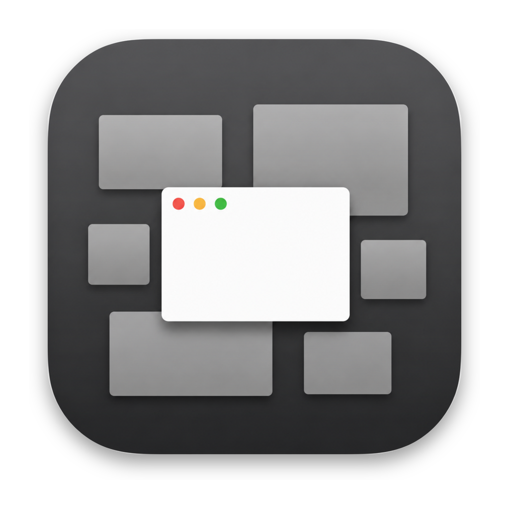

<div align="center">



# CloseUp

**English** · [简体中文](docs/README/README.zh-CN.md) · [繁體中文](docs/README/README.zh-TW.md) · [日本語](docs/README/README.ja.md) · [Français](docs/README/README.fr.md) · [Deutsch](docs/README/README.de.md) · [Español](docs/README/README.es.md) · [Português](docs/README/README.pt-BR.md) · [Русский](docs/README/README.ru.md)

[](https://github.com/oomol-lab/CloseUp/releases/latest)
[](https://github.com/oomol-lab/CloseUp/actions/workflows/ci.yml)
[](LICENSE)
[](https://www.apple.com/macos/)
[](https://swift.org)

</div>

**Put the controls back in Mission Control.** CloseUp overlays window controls
onto the native macOS Mission Control — close, minimize, zoom, hide, or quit any
window without leaving the overview — and adds full keyboard control. Free,
native, and open source.

## Features

- **Close from the overview** — hover a window thumbnail in Mission Control and
  click the red × to close it instantly, without switching to it first.
- **Every window verb** — minimize, zoom, hide the app, or quit the app, each as
  an optional button you can turn on or off.
- **Keyboard control** — act on the window under the pointer with native verbs:
  ⌘W close, ⌘M minimize, ⌘F zoom, ⌘H hide, ⌘Q quit — all remappable.
- **Batch actions** — ⌥⌘W close all, ⌥⌘M minimize all, ⌥⌘H hide all but the
  one under the pointer.
- **Nine languages** — English, 简体中文, 繁體中文, 日本語, Français, Deutsch,
  Español, Português, Русский, switchable in-app and applied live.
- **Native and unobtrusive** — a passive overlay that never steals Mission
  Control's own keyboard handling; menu-bar only, no Dock icon.
- **Auto-updating** — signed, notarized releases via Sparkle.

## Requirements

- macOS 14.0 or later
- Apple Silicon or Intel (universal binary)
- Accessibility permission (CloseUp reads and acts on windows through the
  Accessibility API; it never records your screen)

## Install

Download the latest `.dmg` from [Releases](https://github.com/oomol-lab/CloseUp/releases),
open it, and drag CloseUp to Applications. On first launch, grant Accessibility
access in System Settings → Privacy & Security → Accessibility — CloseUp opens
the right pane for you.

## Usage

Open Mission Control as usual (swipe up with three/four fingers, or the Mission
Control key). Hover any window to reveal its control cluster, or use the
keyboard:

| Action | Shortcut | Acts on |
|---|---|---|
| Close window | ⌘W | window under the pointer |
| Minimize window | ⌘M | window under the pointer |
| Zoom window | ⌘F | window under the pointer |
| Hide app | ⌘H | window under the pointer |
| Quit app | ⌘Q | window under the pointer |
| Close all windows | ⌥⌘W | all windows |
| Minimize all windows | ⌥⌘M | all windows |
| Hide all but this | ⌥⌘H | every app except the one under the pointer |

Every shortcut is remappable in Settings → Shortcuts, and a global hotkey can
toggle CloseUp on or off from anywhere.

## Settings

- **General** — enable/disable, launch at login, which control buttons appear,
  and the in-app language.
- **Shortcuts** — remap every action and the global toggle.
- **Permission** — Accessibility status and a one-click grant.
- **Updates** — automatic checks and a manual "Check for Updates".

## Build from source

```bash
brew install xcodegen
make build      # Debug build (a distinct "CloseUp Dev" identity)
make test       # unit tests + i18n guards
make run        # build and launch
make dmg        # package a drag-to-install .dmg
```

The Xcode project is generated from `project.yml` by XcodeGen and is not checked
in. See [docs/DESIGN.md](docs/DESIGN.md) for the architecture and
[docs/RUNBOOK.md](docs/RUNBOOK.md) for the release process.

## License

[GPL-3.0](LICENSE).

## Acknowledgements

Thanks to [OpenMissionControl](https://github.com/nohackjustnoobb/OpenMissionControl),
[DockDoor](https://github.com/ejbills/DockDoor), and
[alt-tab-macos](https://github.com/lwouis/alt-tab-macos): CloseUp's
use of the private Mission Control APIs is informed by how these projects use
them.
