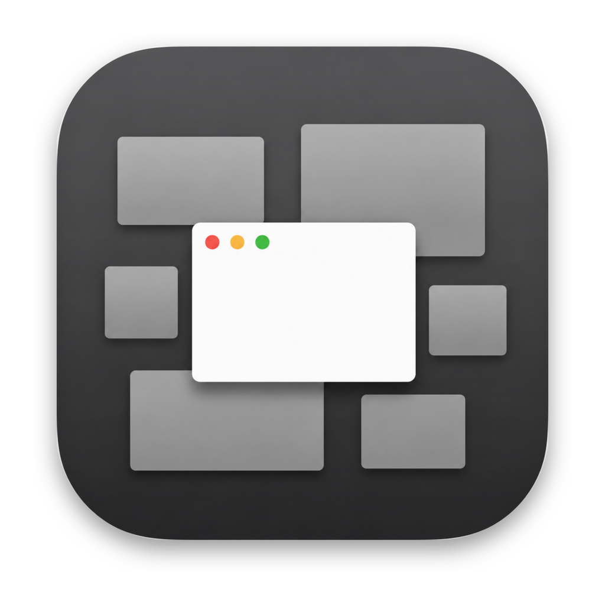
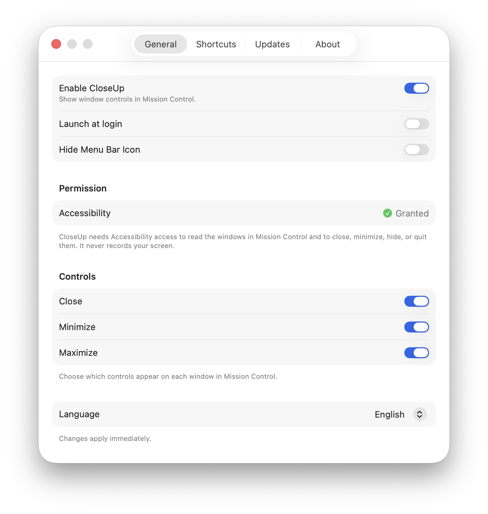

<div align="center">



# CloseUp

**English** · [简体中文](docs/README/README.zh-CN.md) · [繁體中文](docs/README/README.zh-TW.md) · [日本語](docs/README/README.ja.md) · [Français](docs/README/README.fr.md) · [Deutsch](docs/README/README.de.md) · [Español](docs/README/README.es.md) · [Português](docs/README/README.pt-BR.md) · [Русский](docs/README/README.ru.md)

[](https://github.com/oomol-lab/CloseUp/releases/latest)
[](https://github.com/oomol-lab/CloseUp/actions/workflows/ci.yml)
[](LICENSE)
[](https://www.apple.com/macos/)
[](https://swift.org)

</div>

**Put the controls back in Mission Control.** CloseUp overlays window controls
onto the native macOS Mission Control — close, minimize, maximize, hide, or
quit any window without leaving the overview — and adds full keyboard control.
Free, native, and open source.

## Screenshots

<p align="center">
  <picture>
    <source media="(prefers-color-scheme: dark)" srcset="docs/images/overlay-dark.png">
    
  </picture>
</p>

<p align="center">
  <picture>
    <source media="(prefers-color-scheme: dark)" srcset="docs/images/settings-general-en-dark.png">
    
  </picture>
  <picture>
    <source media="(prefers-color-scheme: dark)" srcset="docs/images/settings-shortcuts-en-dark.png">
    
  </picture>
</p>

## Features

- **Close from the overview** — hover a window thumbnail in Mission Control and
  click the red × to close it instantly, without switching to it first.
- **Every window verb** — minimize, maximize, hide the app, or quit the app.
  Close, minimize, and maximize are optional buttons you can turn on or off in
  Settings; hide and quit are always shown when the window supports them.
- **Keyboard control** — act on the window under the pointer with native verbs:
  ⌘W close, ⌘M minimize, ⌘F maximize, ⌘H hide, ⌘Q quit — all remappable.
- **Batch actions** — ⌥⌘W close all, ⌥⌘M minimize all, ⌥⌘H hide all but the
  one under the pointer.
- **Nine languages** — English, 简体中文, 繁體中文, 日本語, Français, Deutsch,
  Español, Português, Русский, switchable in-app and applied live.
- **Native and unobtrusive** — a passive overlay that never steals Mission
  Control's own keyboard handling; menu-bar only, no Dock icon.
- **Auto-updating** — signed, notarized releases via Sparkle, with an optional
  Beta channel.

## How CloseUp compares

CloseUp focuses on one thing — acting on windows directly inside the *native*
Mission Control view. Here's how it stacks up against the closest
alternatives that do the same (verified 2026-07-02 against each project's own
site/repo — see the links for sources; fields the vendor doesn't document are
marked "Not documented" rather than guessed):

| | CloseUp | [Mission Control Close](https://missioncontrolclose.com/) | [Open Mission Control](https://github.com/nohackjustnoobb/OpenMissionControl) | [Mission Control Plus](https://www.fadel.io/missioncontrolplus) |
|---|---|---|---|---|
| Price | Free | £5 one-time (7-day trial) | Free | Paid, price not published (10-day trial) |
| License | Open source (GPL-3.0) | Closed source | Open source (GPL-3.0) | Closed source |
| Actions on the window under the cursor | Close, minimize, maximize, hide, quit | Close only | Close, minimize, maximize | Close, minimize, quit (+ open) |
| Batch actions | Close all, minimize all, hide all but one | Close all | Not documented | Not documented |
| Remappable keyboard shortcuts | Every action | Has shortcuts; remapping not documented | Fixed (⌘Q/⌘W/⌘M/⌘F) | Fixed (⌘W/⌘M/⌘Q/⏎) |
| Localization | 9 languages, switchable in-app | Not documented | Not documented | Not documented |
| macOS requirement | 14.0+ | 26.0 (Tahoe)+ | Not documented | 10.13+ |
| CPU architecture | Apple Silicon & Intel, separate signed builds | Apple Silicon only | Not documented | Not documented |
| Distribution | Direct download + Homebrew, notarized, Sparkle auto-update | Direct download, LemonSqueezy checkout | GitHub + Homebrew (unsigned — you remove the quarantine flag manually) | Direct download |

Other macOS window-management tools — [AltTab](https://github.com/lwouis/alt-tab-macos),
[DockDoor](https://github.com/ejbills/DockDoor), [HyperDock](https://bahoom.com/hyperdock),
[Contexts](https://contexts.co/) — offer related window actions (close, hide,
switch), but through their own switcher or Dock-hover UI rather than the
native Mission Control view, so they solve a related but different problem
and aren't scored above.

## Requirements

- macOS 14.0 or later
- Apple Silicon (arm64) or Intel (x86_64) — CloseUp ships a separate,
  single-architecture build for each; grab the one matching your Mac
- Accessibility permission (CloseUp reads and acts on windows through the
  Accessibility API; it never records your screen)

## Install

Download the release matching your Mac's chip from
[Releases](https://github.com/oomol-lab/CloseUp/releases) — `CloseUp-*-arm64.dmg`
for Apple Silicon, `CloseUp-*-x86_64.dmg` for Intel — open it, and drag CloseUp
to Applications. Or install via Homebrew (auto-detects your architecture):

```bash
brew install --cask oomol-lab/tap/closeup
```

On first launch, grant Accessibility access in System Settings → Privacy &
Security → Accessibility — CloseUp opens the right pane for you.

## Usage

Open Mission Control as usual (swipe up with three/four fingers, or the Mission
Control key). Hover any window to reveal its control cluster, or use the
keyboard:

| Action | Shortcut | Acts on |
|---|---|---|
| Close window | ⌘W | window under the pointer |
| Minimize window | ⌘M | window under the pointer |
| Maximize window | ⌘F | window under the pointer |
| Hide app | ⌘H | window under the pointer |
| Quit app | ⌘Q | window under the pointer |
| Close all windows | ⌥⌘W | all windows |
| Minimize all windows | ⌥⌘M | all windows |
| Hide all but this | ⌥⌘H | every app except the one under the pointer |

Every shortcut is remappable in Settings → Shortcuts. Toggle CloseUp on or off
anytime from the menu-bar icon or Settings → General.

## Settings

- **General** — enable/disable, launch at login, hide the menu-bar icon,
  Accessibility status with a one-click grant, which control buttons appear,
  and the in-app language.
- **Shortcuts** — remap every action.
- **Updates** — automatic checks (Stable or Beta channel) and a manual "Check
  for Updates".
- **About** — version, license, a link to the GitHub repo, and
  acknowledgements.

## Build from source

```bash
brew install xcodegen
make build      # Debug build (a distinct "CloseUp Dev" identity)
make dev-cert   # optional: stable local signing identity so the Accessibility
                # grant survives rebuilds while iterating
make test       # unit tests + i18n guards
make run        # build and launch
make dmg        # package a drag-to-install .dmg
```

The Xcode project is generated from `project.yml` by XcodeGen and is not checked
in. See [docs/DESIGN.md](docs/DESIGN.md) for the architecture and
[docs/RUNBOOK.md](docs/RUNBOOK.md) for the release process.

## License

[GPL-3.0](LICENSE).

## Acknowledgements

Thanks to [OpenMissionControl](https://github.com/nohackjustnoobb/OpenMissionControl),
[DockDoor](https://github.com/ejbills/DockDoor), and
[alt-tab-macos](https://github.com/lwouis/alt-tab-macos): CloseUp's
use of the private Mission Control APIs is informed by how these projects use
them.
